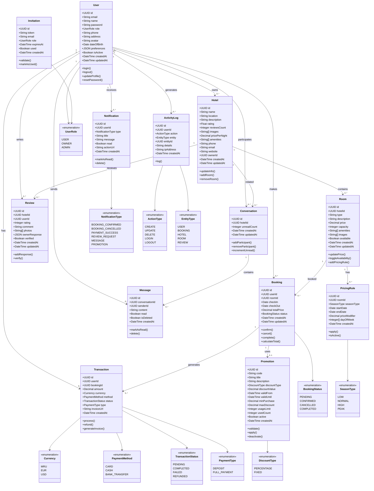

```mermaid
classDiagram
   class User {
       +UUID id
       +String email
       +String name
       +String password
       +UserRole role
       +String phone
       +String address
       +String avatar
       +Date dateOfBirth
       +JSON preferences
       +Boolean isActive
       +DateTime createdAt
       +DateTime updatedAt
       +login()
       +logout()
       +updateProfile()
       +resetPassword()
   }

   class Hotel {
       +UUID id
       +String name
       +String location
       +String description
       +Float rating
       +Integer reviewsCount
       +String[] images
       +Decimal pricePerNight
       +String[] amenities
       +String phone
       +String email
       +String website
       +UUID ownerId
       +DateTime createdAt
       +DateTime updatedAt
       +updateInfo()
       +addRoom()
       +removeRoom()
   }

   class Room {
       +UUID id
       +UUID hotelId
       +String type
       +String description
       +Decimal price
       +Integer capacity
       +String[] amenities
       +String[] images
       +Boolean available
       +DateTime createdAt
       +DateTime updatedAt
       +updatePrice()
       +toggleAvailability()
       +addPricingRule()
   }

   class Booking {
       +UUID id
       +UUID userId
       +UUID roomId
       +Date checkIn
       +Date checkOut
       +Decimal totalPrice
       +BookingStatus status
       +DateTime createdAt
       +DateTime updatedAt
       +confirm()
       +cancel()
       +complete()
       +calculateTotal()
   }

   class Review {
       +UUID id
       +UUID hotelId
       +UUID userId
       +Integer rating
       +String comment
       +String[] photos
       +JSON ownerResponse
       +Boolean verified
       +DateTime createdAt
       +DateTime updatedAt
       +addResponse()
       +verify()
   }

   class Transaction {
       +UUID id
       +UUID userId
       +UUID bookingId
       +Decimal amount
       +Currency currency
       +PaymentMethod method
       +TransactionStatus status
       +PaymentType type
       +String invoiceUrl
       +DateTime createdAt
       +process()
       +refund()
       +generateInvoice()
   }

   class Notification {
       +UUID id
       +UUID userId
       +NotificationType type
       +String title
       +String message
       +Boolean read
       +String actionUrl
       +DateTime createdAt
       +markAsRead()
       +delete()
   }

   class Message {
       +UUID id
       +UUID conversationId
       +UUID senderId
       +String content
       +Boolean read
       +Boolean isDeleted
       +DateTime createdAt
       +markAsRead()
       +delete()
   }

   class Conversation {
       +UUID id
       +UUID hotelId
       +Integer unreadCount
       +DateTime createdAt
       +DateTime updatedAt
       +addParticipant()
       +removeParticipant()
       +incrementUnread()
   }

   class Promotion {
       +UUID id
       +String code
       +String title
       +String description
       +DiscountType discountType
       +Decimal discountValue
       +DateTime validFrom
       +DateTime validUntil
       +Decimal minPurchase
       +Decimal maxDiscount
       +Integer usageLimit
       +Integer usedCount
       +Boolean active
       +DateTime createdAt
       +validate()
       +apply()
       +deactivate()
   }

   class ActivityLog {
       +UUID id
       +UUID userId
       +ActionType action
       +EntityType entity
       +UUID entityId
       +String details
       +String ipAddress
       +DateTime createdAt
       +log()
   }

   class PricingRule {
       +UUID id
       +UUID roomId
       +SeasonType seasonType
       +Date startDate
       +Date endDate
       +Decimal priceModifier
       +Integer[] dayOfWeek
       +DateTime createdAt
       +apply()
       +isActive()
   }

   class Invitation {
       +UUID id
       +String token
       +String email
       +UserRole role
       +DateTime expiresAt
       +Boolean used
       +DateTime createdAt
       +validate()
       +markAsUsed()
   }

   %% Enumerations
   class UserRole {
       <<enumeration>>
       USER
       OWNER
       ADMIN
   }

   class BookingStatus {
       <<enumeration>>
       PENDING
       CONFIRMED
       CANCELLED
       COMPLETED
   }

   class Currency {
       <<enumeration>>
       MRU
       EUR
       USD
   }

   class PaymentMethod {
       <<enumeration>>
       CARD
       CASH
       BANK_TRANSFER
   }

   class TransactionStatus {
       <<enumeration>>
       PENDING
       COMPLETED
       FAILED
       REFUNDED
   }

   class PaymentType {
       <<enumeration>>
       DEPOSIT
       FULL_PAYMENT
   }

   class NotificationType {
       <<enumeration>>
       BOOKING_CONFIRMED
       BOOKING_CANCELLED
       PAYMENT_SUCCESS
       REVIEW_REQUEST
       MESSAGE
       PROMOTION
   }

   class DiscountType {
       <<enumeration>>
       PERCENTAGE
       FIXED
   }

   class SeasonType {
       <<enumeration>>
       LOW
       NORMAL
       HIGH
       PEAK
   }

   class ActionType {
       <<enumeration>>
       CREATE
       UPDATE
       DELETE
       LOGIN
       LOGOUT
   }

   class EntityType {
       <<enumeration>>
       USER
       BOOKING
       HOTEL
       ROOM
       REVIEW
   }

   %% Relationships
   User "1" --> "0..*" Hotel : owns
   User "1" --> "0..*" Booking : makes
   User "1" --> "0..*" Review : writes
   User "1" --> "0..*" Transaction : has
   User "1" --> "0..*" Notification : receives
   User "1" --> "0..*" Message : sends
   User "0..*" --> "0..*" Conversation : participates
   User "1" --> "0..*" ActivityLog : generates

   Hotel "1" --> "0..*" Room : contains
   Hotel "1" --> "0..*" Review : receives
   Hotel "0..1" --> "0..*" Conversation : related

   Room "1" --> "0..*" Booking : booked
   Room "1" --> "0..*" PricingRule : has

   Booking "1" --> "0..*" Transaction : generates
   Booking "1" --> "0..1" Promotion : uses

   Conversation "1" --> "0..*" Message : contains

   %% Enum associations
   User --> UserRole
   Booking --> BookingStatus
   Transaction --> Currency
   Transaction --> PaymentMethod
   Transaction --> TransactionStatus
   Transaction --> PaymentType
   Notification --> NotificationType
   Promotion --> DiscountType
   PricingRule --> SeasonType
   ActivityLog --> ActionType
   ActivityLog --> EntityType
   Invitation --> UserRole
```
